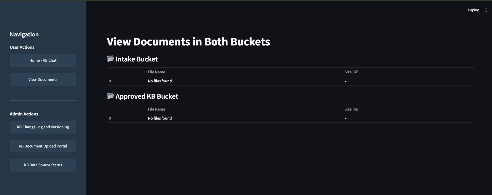

# Bedrock Knowledge Base Management System Demo

This project implements a simple Knowledge Base (KB) management system using AWS Bedrock, S3, DynamoDB, and Lambda. It provides a user-friendly interface for chatting with the KB, managing documents, and monitoring data sources.

The system consists of a Streamlit web application for user interaction and an AWS infrastructure stack for backend operations. It allows users to chat with the KB, view and manage documents, track changes, and monitor data source statuses.



## Repository Structure

```
.
├── app.py
├── custom.css
├── infra.yaml
└── requirements.txt
```

### Key Files:

- `app.py`: The main Streamlit application file containing the user interface and interaction logic.
- `custom.css`: Custom CSS styles for the Streamlit application.
- `infra.yaml`: AWS CloudFormation template defining the infrastructure resources.
- `requirements.txt`: Python package dependencies for the project.

## Usage Instructions

### Installation


Prerequisites:
- Python 3.9 or higher
- AWS CLI configured with appropriate permissions
- Streamlit

To install the required Python packages:

```pip 
install -r requirements.txt
```
or
```bash
pip install streamlit boto3 pandas pytz
```

Deploy the infra.yaml with CloudFormation
```aws
cloudformation deploy --template-file infra.yaml --stack-name MyKBUIStack --capabilities CAPABILITY_NAMED_IAM
```
You need to create the Bedrock KB manually and feed it in to the app.py to keep things simpler.

### Configuration

1. Set up your AWS credentials and region in your environment or AWS CLI configuration.

2. Update the following variables in `app.py`:
   - `bedrock_kb_id`: Your Bedrock Knowledge Base ID
   - `bedrock_model_arn`: The ARN of the Bedrock model you're using

### Running the Application

To start the Streamlit application:

```bash
streamlit run app.py
```

### Features

1. **Chat with Knowledge Base**: Users can interact with the Bedrock Knowledge Base through a chat interface.

2. **View Documents**: Allows users to browse documents stored in the Knowledge Base.

3. **Change Log and Versioning**: Administrators can view the change log and versioning information for the KB.

4. **Document Upload Portal**: Provides an interface for administrators to upload new documents to the KB.

5. **Data Source Status**: Displays the status of connected data sources and allows administrators to initiate sync jobs.

### Troubleshooting

- If you encounter permission errors, ensure your AWS credentials have the necessary permissions to access Bedrock, S3, DynamoDB, and Lambda services.
- For issues with data source syncing, check the AWS CloudWatch logs for the relevant Lambda functions.

## Data Flow

The application follows this general data flow:

1. User interacts with the Streamlit interface.
2. Requests are sent to AWS services (Bedrock, S3, DynamoDB) via boto3 clients.
3. For KB queries, the application uses the Bedrock client to retrieve and generate responses.
4. Document management operations interact with S3 buckets and DynamoDB tables.
5. Data source status and sync operations use the Bedrock agent build-time client.

```
[User] <-> [Streamlit App] <-> [AWS Services]
                               |
                               +-- [Bedrock KB]
                               |
                               +-- [S3 Buckets]
                               |
                               +-- [DynamoDB Tables]
                               |
                               +-- [Lambda Functions]
```

## Infrastructure

The `infra.yaml` file defines the following AWS resources:

### S3
- `IntakeBucket`: Stores raw intake documents
- `KBApprovedBucket`: Stores approved KB documents

### DynamoDB
- `ChangelogTable`: Tracks file status changes
- `VersionCounterTable`: Stores global version counter for the KB

### IAM
- `LambdaExecutionRole`: IAM role for Lambda functions with permissions to access S3 and DynamoDB

### Lambda
- `ApproveFileLambda`: Processes file approvals and updates version information
- `DeleteFileLambda`: Handles file deletion, ensuring only the latest approved version can be removed
